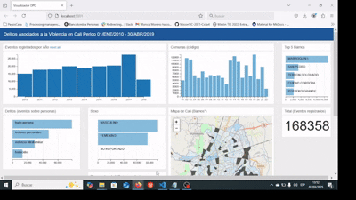

# Dashboard de Delitos en Cali - Observatorio de Paz y Cultura Ciudadana


## Descripción del Proyecto
Este proyecto piloto consiste en un visualizador interactivo de datos sobre cuatro tipos de delitos en la ciudad de Santiago de Cali. La fuente de los datos proviene de los datos abiertos de la Policía Nacional, y el proyecto fue desarrollado durante mi trabajo como analista de datos en el Observatorio de Paz y Cultura Ciudadana. de la Secretaría de Paz y Cultura Ciudadana.

El objetivo principal de este dashboard es proporcionar una herramienta visual e interactiva que permita explorar patrones delictivos a través del tiempo y el espacio, facilitando así la toma de decisiones informadas en materia de seguridad y convivencia ciudadana.

## Tecnologías Utilizadas
El sistema fue desarrollado utilizando una combinación de herramientas y tecnologías enfocadas en la manipulación, visualización y presentación de datos:

- **Python (Pandas, Flask)**: Para la limpieza, estructuración y procesamiento de los datos antes de ser presentados en el dashboard.
- **JavaScript (D3.js, DC.js, Leaflet.js)**: Para la construcción de gráficos interactivos y mapas geoespaciales que muestran la distribución de los delitos en la ciudad.
- **HTML, CSS**: Para la interfaz del dashboard y el diseño responsivo.

## Características del Dashboard
- **Mapa Interactivo:** Utiliza Leaflet.js para mostrar la distribución geográfica de los delitos reportados en diferentes sectores de Cali.
- **Gráficos Dinámicos:** Implementados con DC.js y D3.js, permitiendo explorar tendencias temporales y categorizaciones de los delitos.
- **Filtros y Exploración Interactiva:** Los usuarios pueden seleccionar diferentes filtros y visualizar cambios en tiempo real en los gráficos y mapas.

## Experiencia Técnica y Aprendizajes
Este proyecto me permitió aplicar y fortalecer mis habilidades en:
- **Análisis de datos con Python y Pandas**, desde la recopilación hasta la transformación de datos en información útil.
- **Desarrollo web con Flask**, para servir los datos y la interfaz del dashboard.
- **Visualización avanzada con JavaScript**, combinando D3.js y DC.js para gráficos interactivos.
- **Integración de mapas geoespaciales con Leaflet.js**, enriqueciendo la representación visual de los datos.
- **Despliegue de aplicaciones interactivas**, asegurando rendimiento y accesibilidad para los usuarios finales.

## Instalación y Uso
1. Clonar el repositorio:
   ```sh
   git clone https://github.com/tuusuario/dashboard-delitos-cali.git
   cd dashboard-delitos-cali
   ```
2. Instalar dependencias en un entorno virtual de Python:
   ```sh
   python -m venv env
   source env/bin/activate  # En Windows usar `env\Scripts\activate`
   pip install -r requirements.txt
   ```
3. Ejecutar el servidor Flask:
   ```sh
   python app.py
   ```
4. Abrir el navegador en `http://localhost:5000` para ver el dashboard en acción.

## Próximos Pasos
Este piloto sienta las bases para futuros proyectos de visualización de datos delictivos, con posibles mejoras como:
- Actualización con datos del 2018 a 2024
- Integración con bases de datos en tiempo real.
- Análisis predictivo utilizando modelos de Machine Learning.
- Optimización para dispositivos móviles.

## Contacto
Si deseas conocer más sobre este proyecto o colaborar en iniciativas similares, puedes contactarme a través de [GitHub](https://github.com/andres-ss25) o [LinkedIn](www.linkedin.com/in/andrés-felipe-suárez-sánchez-dev).


